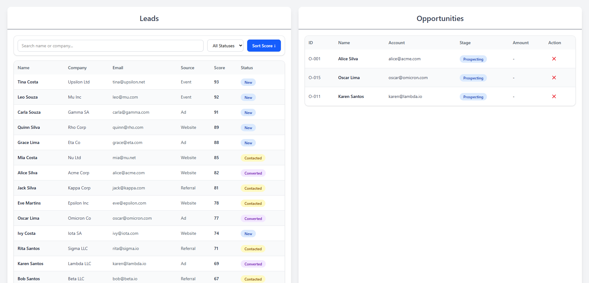
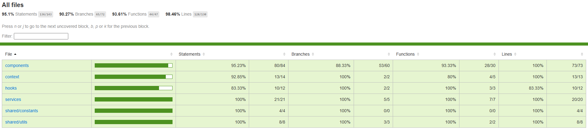

# Leads & Opportunities Management

<div align="center">
  <a href="https://www.linkedin.com/in/leonardo-altemari-008a8017b/">
    
  </a>

  <a href="https://github.com/leoaltemari/leads-opportunities/blob/development/LICENSE">
    
  </a>
</div>

### 🚀 Description

<div style="margin-bottom: 16px;" align="center">
  
</div>

This is a **web application to manage leads and opportunities**, featuring:

- Viewing leads and opportunities in tables
- Filtering, searching, and sorting leads
- Converting leads into opportunities
- Infinite scroll for paginated leads
- Inline editing and saving of leads

The project is built with **React**, **TypeScript**, **Tailwind** and **React Hooks** for state management.

---

## 📜 Table of Contents

- [Installation](#installation)
- [Usage](#usage)
- [Unit Tests](#unit-tests)
- [Contributing](#contributing)
- [License](#license)
- [Contact](#contact)

---

## 🔥 Installation

1. Install Node.js and npm if not already installed.
2. Clone the repository:
  ```bash
git clone https://github.com/leoaltemari/mini-seller-console.git
  ```
3. Navigate to the project directory:
  ```bash
cd mini-seller-console
  ```
4. Install dependencies:
  ```bash
npm install
  ```
---

## 🌐 Usage

1. Run the development server:
  ```bash
npm run dev
  ```
2. Open your browser and navigate to: http://localhost:5173/
3. Use the interface to:
   - View leads and opportunities
   - Filter, sort, and search leads
   - Convert leads into opportunities
   - Save and edit leads

---

## 🧪 Unit Tests

Unit tests are implemented using **Jest** and **React Testing Library**. The tests cover:

- Custom hooks (`useFetchLeads`, `useLocalStorage`)
- Context providers (`OpportunitiesContext`)
- Components (`LeadsTable`, `LeadsTableFilter`, `LeadDetailSlide`, `OpportunitiesTable`)
- Utility functions (`isValidEmail`, `simulateFailure`)
- Services (`getLeads`, `saveSingleLead`)

### Run tests
1. Without coverage status
```bash
  npm run test
```
2. With coverage status
```bash
  npm run test:coverage
```

### Coverage
<div style="margin-bottom: 16px;" align="center">
  
</div>

- The project aims for **75% coverage** for lines, branches, functions, and statements.
- Tests include mocking external dependencies such as fetch requests, local storage, and context hooks.
- React state updates are wrapped in `act(...)` to avoid warnings.

---

## 👥 Contributing

1. Fork the repository.
2. Create a feature branch:
   git checkout -b feat/feature-name
3. Commit your changes:
   git commit -m "Description of changes"
4. Push to the branch:
   git push origin feat/feature-name
5. Create a pull request.

---

## 🔐 License

[MIT License](LICENSE)

---

## 📱 Contact

For questions or support, contact:

- **Author**: Leonardo Altemari Nogueira
- **Linkedin**: [Leonardo Altemari](https://www.linkedin.com/in/leonardo-altemari/)
- **Email**: leo.altemari@gmail.com
